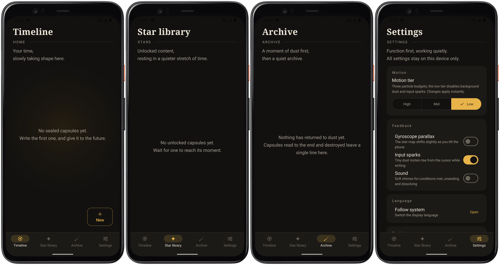

# Timart (时粒)

[简体中文](README.md) ｜ [English](README.en.md)

**Timart** is a local-first Android time-capsule app: write a letter to the future, seal it behind real-world unlock conditions, and it can only be opened when those conditions are genuinely met.

## Preview

## What it solves

Write a letter and hand it over to time:

- A letter that can't be read until **this day one year from now**
- A reward you allow yourself to see only after **30 days of 8,000+ steps**
- Travel notes that unlock **the next time it rains in Tokyo**
- A follow-up letter that stays sealed until **its predecessor has been read**

Until the conditions are met, the content stays encrypted on-device — even the app itself cannot read it. The moment every condition is satisfied, the capsule unlocks and sends a notification.

## Key Features

- **52 unlock condition types**, combined with AND ("all must be met") or OR ("any will do") semantics:
  - **Time** (9): fixed date / fixed date-time / N days elapsed / N minutes elapsed / day of week / time range / monthly day / yearly date / lunar festivals (Chinese New Year, Mid-Autumn…)
  - **Device state** (11): battery level / charging state / power-save mode / silent mode / headphone connected / airplane mode / music playing / before the next alarm / motion state (walking/still) / compass heading / altitude range
  - **Location & environment** (14): arrive at a place / leave a place (radius-based) / weather type / temperature range / humidity·wind·pressure·UV / network type / Wi-Fi SSID / sun phase / golden hour / moon phase / meteor-shower peak night / darkness (light sensor) / another timezone / on the move (GPS speed)
  - **In-app stats & links** (10): daily step count / step streak / total open count / consecutive open days / days since last open / capsule count reached / another capsule unlocked / destroyed / opened & read / gazed at this capsule N times
  - **Live challenges** (8): question / riddle / shake / flip-and-hold / long-press / biometric (fingerprint/face) / photo keepsake / NFC tap — completed on the spot when opening the capsule, never counted by automatic checks
- **Device-capability gating**: conditions your hardware can't support (e.g. altitude without a barometer, NFC tap without an NFC chip, biometrics without a fingerprint sensor, darkness without a light sensor) are disabled at creation time with a stated reason; importing a backup also flags conditions this device can never meet
- **"Regret pill" — one-time rule edit**: each capsule carries exactly one chance — long-press the dust core for 3 seconds (or tap it 5 times quickly) to reveal a hidden editor for its unlock conditions (deliberately hidden; you only find it when you truly want to open it)
- **Capsule dependencies**: a capsule can require another capsule to be unlocked first, with automatic cycle detection, dead-link and self-dependency validation
- **Destroy after reading**: optional "return to dust" — at the end of a reading, ciphertext and images are physically deleted and only a metadata record remains. Destruction always requires explicit confirmation; there is no silent path. In the star library you can also batch "destroy" (leaves a dust record) or "delete" (removes completely)
- **On-device encryption**: the passphrase is stretched with Argon2id and content is sealed with AES-256-GCM, one independent nonce per capsule and per image; the passphrase never touches storage, and ciphertext is useless off-device
- **Keyless cold start**: the session key is wrapped by the Android Keystore for 72 hours, so you don't re-enter the passphrase on every launch; locking wipes it immediately
- **Trilingual UI**: Simplified Chinese / Traditional Chinese / English / follow-system, applied instantly without restarting the app
- **Time-track universe**: capsules orbit on a draggable, zoomable star map ordered by creation time — unopened orbs glow bright gold, read ones dim to an ember, at a glance; swipe the bottom preview card to switch between "latest capsule" and "almost there" (the locked capsule closest to being met)
- **Keepsake poster & backup**: generate a shareable poster after unlocking; export everything as a fully encrypted backup archive and restore it on another device
- **Local-first**: the only network calls are a weather lookup at Open-Meteo (nothing but the city's coordinates) and, only when you resolve an address for a GPS condition, open geocoder queries (Nominatim/Photon/Tianditu — nothing but the place text you typed). No analytics, no tracking, no accounts

## Requirements

Android 7.0 (API 24) or newer.

## How to Use

1. **Set a passphrase**: the first seal guides you through creating one — it is the only key to your data. Forget it and the data is gone forever
2. **Write & seal**: compose the letter, attach photos, capture the current weather, pick unlock conditions (or none — then the capsule opens immediately), and seal in three steps
3. **Wait for the moment**: the capsule sits on the time-track star map; the app checks conditions every 6 hours in the background and instantly on every foreground return. When everything is met, a local notification arrives
4. **Read & archive**: unseal and read (live challenges are completed on the spot while opening); capsules with "destroy after reading" are physically deleted once finished, leaving only a memorial record; unlocked capsules live in the star library (tag filters, batch destroy or delete), and you can generate a keepsake poster or export an encrypted backup at any time

## Security & Privacy

- Capsule content (text and images) is **always encrypted** before it hits storage; plaintext exists only in memory for the moment of reading
- The passphrase is the only key: **forget it and the data is gone forever** — there is no recovery path
- Destruction requires explicit confirmation (a second-confirmation dialog, or a "destroy or keep" prompt on back); there is no silent destruction path
- The only network requests are the Open-Meteo weather query (city coordinates only) and the Nominatim/Photon/Tianditu geocoder fallback for GPS conditions (only the place text you typed, fired only when you tap resolve); no telemetry, no tracking, no accounts

## License

This project is released under the [GNU General Public License v3.0 (GPL-3.0)](LICENSE).

## Feedback

Questions and suggestions are welcome: [timart@muxiaowf.top](mailto:timart@muxiaowf.top), or open an issue.
