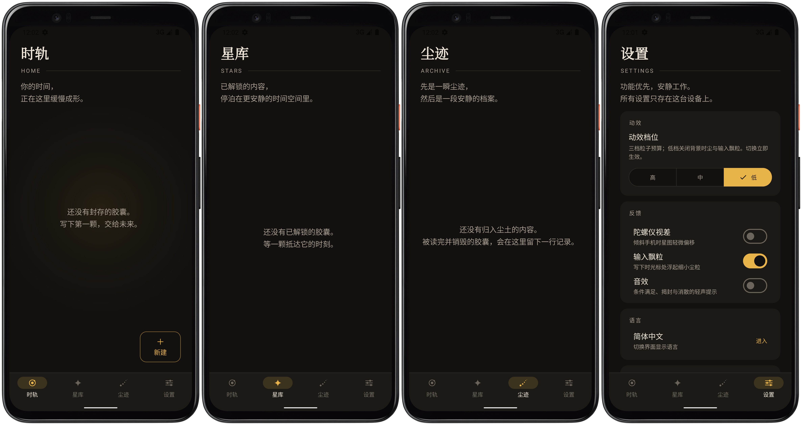

# 时粒 Timart

[简体中文](README.md) ｜ [English](README.en.md)

**时粒**是一款 Android 本地时间胶囊应用：写下一封信，为它设定一组现实世界的解锁条件——只有当条件真正被满足时，信才能被打开。

## 预览

## 它解决什么问题

给自己写一封信，然后把它交给时间：

- 「一年后的今天」才能读到的一封信
- 「连续 30 天步数超过 8000」才允许自己看到的奖励
- 「下次到东京下雨时」才开启的旅行笔记
- 「读完上一封信」之后才能开启的下一封信

条件未满足时，内容处于端侧加密状态，连应用自己都无法解读；条件全部满足的那一刻，胶囊解锁并发出通知。

## 核心特性

- **109 种解锁条件**，按需组合（「全部满足 AND」/「任意满足 OR」/「N 条满足 M 条即可」——备一把「备用钥匙」，差一条也能开）：
  - **时间**（21 种）：指定日期 / 指定时刻 / 满 N 天 / 满 N 分钟 / 星期几 / 时间段 / 每月几号 / 每年今日 / 农历节日（春节、中秋等）/ 节气 / 星座季 / 白昼时长 / 日出日落时刻段 / 月内第 N 个星期几 / 闰日 等
  - **设备状态**（25 种）：电量区间 / 充电状态 / 省电模式 / 静音模式 / 耳机连接 / 飞行模式 / 正在播放音乐 / 下一闹钟之前 / 运动状态（行走/静止）/ 指南针朝向 / 海拔区间 / 深色模式 / 勿扰模式 / 媒体音量 / VPN / 电池温度 / 横竖屏 / 蓝牙音频设备 / 接近遮挡 / 开机以来时长 / 已安装某应用 等
  - **位置与环境**（24 种）：到达某地 / 离开某地（半径判定）/ 天气类型 / 气温区间 / 湿度·风速·气压·紫外线 / 网络类型 / Wi-Fi 名称 / 日出日落时段 / 金色时刻 / 月相 / 流星雨极大夜 / 黑暗中（光线传感器）/ 另一个时区 / 移动中（GPS 速度）/ 空气质量 / 风向 / 半球 / 所在城市 等
  - **应用内统计与联动**（20 种）：今日步数 / 连续步数达标 / 累计开启次数 / 连续开启天数 / 距上次开启天数 / 胶囊总数达标 / 另一颗胶囊已解锁 / 已销毁 / 已开启阅读 / 凝视这颗胶囊 N 次 / 累计注视时长 / 今日打开次数 / 完成过一次备份 等
  - **现场挑战**（19 种）：问答 / 谜题 / 摇一摇 / 翻面静置 / 长按不放 / 生物识别（指纹/面容）/ 拍照留念 / NFC 触碰 / 手势图案 / 语音口令 / 扫码 / 保持静止 / 音量键组合 等——打开胶囊时当场完成，不参与自动巡检
- **设备能力门控**：本机硬件不支持的条件（如无气压计的海拔、无 NFC 的触碰、无指纹硬件的生物识别、无光线传感器的黑暗中）在创建时即不可选并注明原因；导入备份时也会提示哪些条件在本机无法达成
- **「后悔药」条件修改**：每颗胶囊一次机会——长按尘核 3 秒（或快速连点 5 次）唤出隐藏入口，可修改解锁条件（入口刻意隐蔽，只有真心想开的时候才会找到）
- **胶囊依赖**：一颗胶囊可以把另一颗设为前置条件，应用自动做环检测、死链与自依赖校验
- **阅读后销毁**：可选「读后归尘」——阅读结束时物理删除密文与图片，只留一条元记录档案，且必须显式确认，不存在静默销毁；星库中也可批量「归为销毁」（留档案）或「删除」（彻底移除）
- **仪式与表达**：封存时可以录一段声音留言、画一幅手绘、选一种信纸，或把胶囊封成「盲盒」——开启前不知道里面写了什么；支持写**回信**（回信留存于尘迹档案）、把一颗胶囊作为**礼物赠予他人**（口令随礼物走，只有持口令的人能打开）、用 **NFC 卡贴**做实体锚点（贴在想要的地方，碰一碰即达）
- **胶囊结构**：拼图胶囊——多段内容按顺序逐段解锁，最终拼成完整一封；嵌套胶囊——开启外层后唤醒内层的休眠种子
- **氛围与纪念**：环境音场景与触觉签名让揭封更有质感；星图上有星座连线与成熟度渐变，「今日抽一颗」帮你选出今天该打开的那封；每年生成一份**年度星图报告**海报；销毁的胶囊在尘迹档案中留有「一生」记录
- **端侧加密**：口令经 Argon2id 派生密钥，AES-256-GCM 加密正文与每张图片；口令不落盘，密文离开本机不可解
- **会话免输口令**：会话密钥经 Android Keystore 包裹保存 72 小时，冷启动免重输；主动锁定立即失效
- **三语界面**：简体中文 / 繁體中文 / English / 跟随系统，切换即时生效、无需重启应用
- **时轨宇宙**：胶囊按创建时间排布在可拖拽、可缩放的星图轨道上——未开启的金球明亮、已读的余温降档，一眼可辨；底部预览卡左右滑动切换「最近的一颗」与「即将达成的一颗」（按条件达成进度挑选）
- **纪念海报与备份**：解锁后可生成分享海报，尘迹档案也能导出纪念页；全部数据可导出为整体加密的备份包；可选**自动定期本地备份**——按你选择的周期，把加密备份写入你指定的本地目录，并保留最近几份；**整库体检**一键检查孤儿记录、依赖死链与文件完整性；**跨设备迁移向导**分步引导旧机导出、新机导入与核对
- **本地优先**：网络行为仅两类——向 Open-Meteo 查询天气（只发送城市坐标）与创建 GPS 条件时的地址解析兜底（Nominatim/Photon/天地图，只发送你输入的地点名称），均无任何用户标识

## 系统要求

Android 7.0（API 24）及以上。

## 使用流程

1. **设置口令**：首次封存前会引导你设置隐私口令——它是解密的唯一钥匙，遗忘即永久丢失，请务必牢记
2. **写下并封存**：写正文、附照片、记录当下天气，选择解锁条件（也可以不设条件，封存后立即可开启），三步封存
3. **等待解锁**：胶囊在时轨星图上等待；应用每 6 小时在后台检测一次，回到前台也会立即检测，条件全部满足时收到本地通知
4. **阅读与归档**：拆封阅读（现场挑战类条件在打开时当场完成）；开启「阅读后销毁」的胶囊读完即物理删除，只在尘迹档案留一条纪念记录；已解锁的胶囊集中在星库管理（标题搜索、状态与标签筛选、批量归为销毁或删除），随时可生成纪念海报或导出加密备份

## 安全与隐私

- 胶囊内容（正文与图片）**必须加密**后才会落盘；明文只在解锁阅读的瞬间存在于内存
- 口令是唯一的解密钥匙：**遗忘口令即永久丢失**，没有任何找回途径
- 销毁必须显式确认（二次确认弹窗 / 返回时「销毁或保留」），不存在静默销毁路径
- 网络请求仅有两类：Open-Meteo 天气查询（参数只有城市经纬度）与 GPS 条件的地址解析兜底 Nominatim/Photon/天地图（只发送你输入的地点文字，仅在你主动解析时触发）；无统计、无追踪、无账号体系
- 自动备份只写入你在设备上选择的本地目录，内容整体加密，不经任何网络

## 开源许可

本项目基于 [GNU General Public License v3.0（GPL-3.0）](LICENSE) 开源发布。

## 反馈

问题与建议欢迎来信：[timart@muxiaowf.top](mailto:timart@muxiaowf.top)，或提 Issue。
